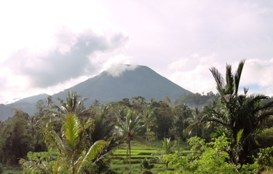

# Multi-CAST Tondano

## How to cite

If you use these data please cite
- the original source
  > Brickell, Timothy. 2023. Multi-CAST Tondano. In Haig, Geoffrey & Schnell, Stefan (eds.), Multi-CAST: Multilingual corpus of annotated spoken texts. Version 2311. Bamberg: University of Bamberg. (multicast.aspra.uni-bamberg.de/#tondano) (date accessed)
- the derived dataset using the DOI of the [particular released version](../../releases/) you were using



## Description


The Toulour dialect of **Tondano** ([tond1251](https://glottolog.org/resource/languoid/id/tond1251)) is an Austronesian (Malayo-Polynesian, Philippine, Minahasa, North, Northeast) language spoken in and to the east of the town of Tondano, which is located in the Minahasa regency of North Sulawesi, Indonesia. All Minahasan languages are endangered and have been shifting to the most commonly used language of wider communication, Manado Malay ([mala1481](https://glottolog.org/resource/languoid/id/mala1481)), since the early 20th century ([Wolff 2010](Source#cldf:wolff2010): 299). Personal experience of the researcher estimates the number of fluent speakers of Tondano at around 30 000.

This corpus is the result of fieldwork undertaken by Timothy Brickell as part of PhD candidature at La Trobe University, Melbourne, Australia between 2011 and 2015 (see [Brickell 2015](Source#cldf:brickell2015)). The speakers recorded were of both genders, of various ages, and from a number of professions, with many older speakers already retired. The texts in Multi-CAST constitute a subset of the 20 recordings made by Brickell. In some instances speakers discuss a topic chosen just prior to recording, in others they talk while engaging in traditional activities, while in some they narrate an elicitation video which depicts other community members carrying out traditional cultural activities.

This dataset is licensed under a CC-BY-4.0 license

Available online at https://multicast.aspra.uni-bamberg.de/#tondano


```geojson
{
    "type": "FeatureCollection",
    "features": [
        {
            "type": "Feature",
            "geometry": {
                "type": "Point",
                "coordinates": [
                    124.964,
                    1.28024
                ]
            }
        },
        {
            "type": "Feature",
            "geometry": {
                "type": "Polygon",
                "coordinates": [
                    [
                        [
                            119.964,
                            6.28024
                        ],
                        [
                            129.964,
                            6.28024
                        ],
                        [
                            129.964,
                            -3.71976
                        ],
                        [
                            119.964,
                            -3.71976
                        ],
                        [
                            119.964,
                            6.28024
                        ]
                    ]
                ]
            }
        }
    ]
}
```


## Corpus counts

Only a small number of basic GRAID symbols are counted:

*Function symbols*
- ⟨0⟩ zero
- ⟨pro⟩ definite pronoun
- ⟨np⟩ full noun phrase
- ⟨other⟩ form not further specified

*Person/Animacy symbols*
- ⟨.1⟩ first person
- ⟨.2⟩ second person
- ⟨.h⟩ third person, human
- ⟨.d⟩ third person, anthropomorphic
- ø third person, non-human

*Function symbols*
- ⟨:s⟩ subject of an intransitive clause
- ⟨:a⟩ subject of a transitive clause
- ⟨:ncs⟩ non-canonical subject
- ⟨:p⟩ direct object
- ⟨:obl⟩ oblique argument
- ⟨:g⟩ goal argument
- ⟨:l⟩ locational argument
- ⟨:pred⟩ predicate
- ⟨:poss⟩ possessive
- ⟨:other⟩ function not further specified

Only basic categories are listed; categories represented by complex symbols with additional
specifiers (e.g. ⟨dem_pro⟩ ‘demonstrative pronoun’) have been subsumed under the more basic
category (e.g. ⟨pro⟩ ‘definite pronoun’). Please refer to the annotation notes for this corpus for
information on all annotated categories, including those not listed here.

| GRAID | ⟨:s⟩ | ⟨:a⟩ | ⟨:ncs⟩ | ⟨:p⟩ | ⟨:obl⟩ | ⟨:g⟩ | ⟨:l⟩ | ⟨:pred⟩ | ⟨:poss⟩ | ⟨:other⟩ | totals |
|:--------------|-------:|-------:|---------:|-------:|---------:|-------:|-------:|----------:|----------:|-----------:|---------:|
| **⟨0.1⟩** | 36 | 38 | 0 | 6 | 0 | 0 | 0 | 0 | 0 | 0 | 80 |
| **⟨0.2⟩** | 4 | 10 | 0 | 1 | 0 | 0 | 0 | 0 | 0 | 0 | 15 |
| **⟨0.h⟩** | 13 | 284 | 0 | 9 | 0 | 0 | 0 | 0 | 0 | 0 | 306 |
| **⟨0.d⟩** | 0 | 0 | 0 | 0 | 0 | 0 | 0 | 0 | 0 | 0 | 0 |
| **⟨0⟩** | 70 | 0 | 0 | 201 | 0 | 0 | 0 | 1 | 0 | 0 | 272 |
| **⟨pro.1⟩** | 52 | 31 | 0 | 13 | 0 | 1 | 0 | 0 | 59 | 0 | 156 |
| **⟨pro.2⟩** | 10 | 8 | 0 | 2 | 0 | 0 | 0 | 0 | 0 | 0 | 20 |
| **⟨pro.h⟩** | 83 | 215 | 0 | 12 | 2 | 0 | 0 | 0 | 19 | 0 | 331 |
| **⟨pro.d⟩** | 0 | 0 | 0 | 0 | 0 | 0 | 0 | 0 | 0 | 0 | 0 |
| **⟨pro⟩** | 62 | 3 | 0 | 77 | 0 | 1 | 0 | 0 | 37 | 3 | 183 |
| **⟨np.1⟩** | 0 | 0 | 0 | 0 | 0 | 0 | 0 | 0 | 0 | 0 | 0 |
| **⟨np.2⟩** | 0 | 0 | 0 | 0 | 0 | 0 | 0 | 0 | 0 | 0 | 0 |
| **⟨np.h⟩** | 26 | 32 | 0 | 14 | 13 | 2 | 0 | 9 | 11 | 1 | 108 |
| **⟨np.d⟩** | 0 | 1 | 0 | 0 | 0 | 0 | 0 | 0 | 0 | 0 | 1 |
| **⟨np⟩** | 93 | 5 | 0 | 271 | 21 | 51 | 130 | 65 | 15 | 69 | 720 |
| **⟨other.1⟩** | 0 | 0 | 0 | 0 | 0 | 0 | 0 | 0 | 0 | 0 | 0 |
| **⟨other.2⟩** | 0 | 0 | 0 | 0 | 0 | 0 | 0 | 0 | 0 | 0 | 0 |
| **⟨other.h⟩** | 0 | 0 | 0 | 0 | 0 | 0 | 0 | 0 | 0 | 0 | 0 |
| **⟨other.d⟩** | 0 | 0 | 0 | 0 | 0 | 0 | 0 | 0 | 0 | 0 | 0 |
| **⟨other⟩** | 0 | 0 | 0 | 0 | 0 | 0 | 0 | 110 | 0 | 0 | 110 |
| | 449 | 627 | 0 | 606 | 36 | 55 | 130 | 185 | 141 | 73 | 2302 |


**Clause boundaries**

| GRAID | count |
|:-----------|--------:|
| **⟨##⟩** | 913 |
| **⟨#⟩** | 172 |
| **totals** | 1085 |


## Corpus metadata

- [Annotation notes](cldf/media/annotation-notes.pdf)
- [Metadata](cldf/media/metadata.pdf)
- [Translated texts](cldf/media/translated-texts.pdf)


## CLDF Datasets

The following CLDF datasets are available in [cldf](cldf):

- CLDF [TextCorpus](https://github.com/cldf/cldf/tree/master/modules/TextCorpus) at [cldf/TextCorpus-metadata.json](cldf/TextCorpus-metadata.json)